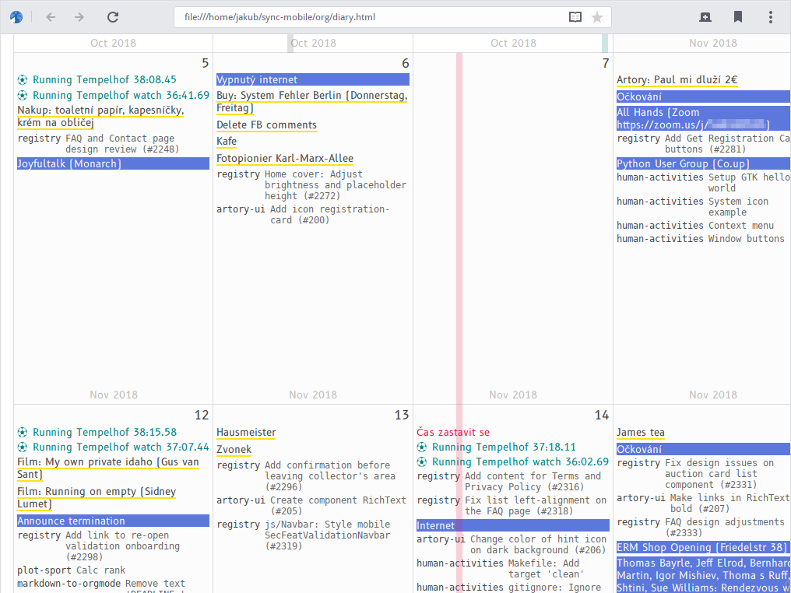

# Automatic Diary

*Locating myself in the stream of life*

Automatic Diary is a program that compiles information about your life from
various digital sources into one easy to read stream.



_On the screenshot above, you can see: calendar events (blue), completed todo
list items (yellow), sport activity (green), and films watched (red)._

## Why

Automatic Diary can be useful to those who:

(a) have bad memory,\
(b) want to remember what they did,\
(c) but don't have the time to write a real diary.

## What is collected

- [X] Calendar events (via CalDAV service and iCalendar file reading)
- [X] Emails sent and received (via Maildir reading)
- [X] Sport activity (via spreadsheet parsing)
- [X] Facebook and Twitter posts (via Facebook/Twitter data archive parsing)
- [X] Software development work (via Git repository log)
- [X] Completed todo list items (via todo.txt parsing)
- [X] Films watched (via ČSFD website parsing)
- [X] Custom diary notes (via plain-text and Org-mode files parsing)

## What is not collected

Please be aware of the activities that are not collected by Automatic Diary:

- emotions
- conversations
- uplanned activities (meeting someone, visiting a place)
- house work
- repairs
- unpublished projects
- reading books
- health
- sleep
- what other people did

## Future

Automatic Diary could be extended to collect also the following data but right
now it is considered low priority:

- [ ] Custom notes and ideas
- [ ] Articles and blog posts written
- [ ] Phone calls and text messages (SMS)
- [ ] Social media private messages and messaging apps
- [ ] Browser history
- [ ] Music listened (via Last.fm)
- [ ] OpenStreetMap contributions
- [ ] Money transfers
- [ ] News headlines
- [ ] Weather

## Installation

### Prerequisites

- Python 3.7
- Linux with libsecret available.

### Installation on Arch Linux

```
# pacman -S pipenv jq libsecret
$ make setup
```

## Usage

### Supported providers (date sources)

- caldav
- csfd
- csv
- facebook
- git
- icalendar
- maildir
- orgmode
- todotxt
- twitter
- txt

### Configuration

The providers are configured using a `config.json` file. Use
[config-sample.json](./config-sample.json) as a documentation and template.

### Generating CSV

The basic output of Automatic Diary is a CSV file. Generate it by running:

```
./automatic-diary <config path> <output csv path>
```

Example:

```
./automatic-diary ~/.config/automatic-diary/config.json ~/Desktop/automatic_diary.csv
```

The output is in format:

```
<datetime>,<provider>,<subprovider>,<text>
```

Example output:

```
2019-01-23T15:31:54-08:00,git,human-activities,model: Log exceptions while scanning
2019-01-24T09:00:00+01:00,caldav,https://dav.mailbox.org/caldav/Y2FsOi8vMC8yNg,DHL Packstation
2019-01-25,todotxt,done.txt,Opravit Ondrovi kolo
```

### Visualization

The generated CSV file can also be rendered as an HTML document which resembles
a calendar (this is what is on the screenshot above). Generate the HTML
visualization by running:

```
./automatic-diary-visualize <csv path> <output html path>
```

Example:

```
./automatic-diary-visualize ~/Desktop/automatic_diary.csv ~/Desktop/automatic_diary.html
```

## Development

### Installation

```
make setup-dev
```

### Testing and linting

```
make test
make lint
```
